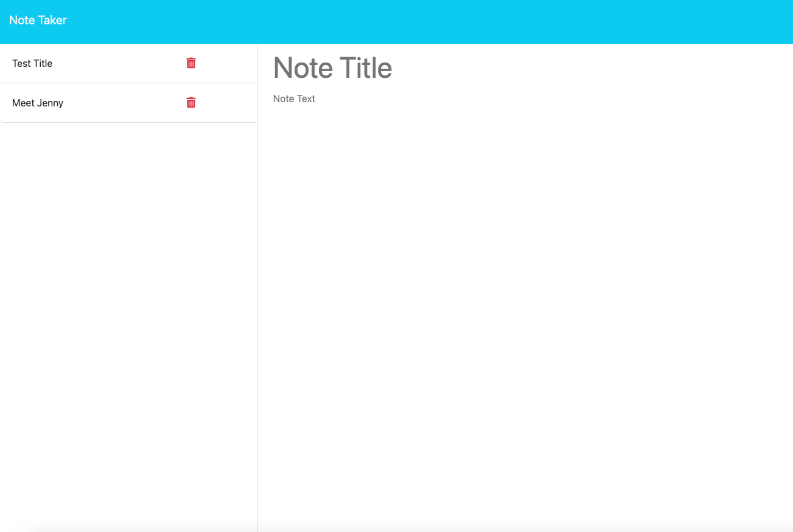

# Note Taker

## Description

A note taking app, where notes can be stored, read, and deleted.
This will allow users to keep track of thoughts, schedules, lists etc. that they need to periodically review. This project also uses express to create a server and routes between different static pages.

## Table of Contents (Optional)

If your README is long, add a table of contents to make it easy for users to find what they need.

- [Installation](#installation)
- [Usage](#usage)
- [Credits](#credits)
- [License](#license)
- [Features](#features)

## Installation

Click the following link to run the app:

https://warm-ocean-32017-3da30a6fefb4.herokuapp.com/notes

## Usage

After going to the landing page hit get started. 

You'll then see a page with your old notes in the left hand column, and a place to write new notes in the right hand column. 

The left hand column holds your old notes:

The right hand column you can write in it. At the top of the page a clear button and a save button will appear. Both a title and text must be added to save.

After hitting save the new note should be on the left hand side. If you hit the trash can the note will be deleted.

If you click an old note it will show up on the right hand column.

## Credits

tutorials:
https://www.youtube.com/watch?v=SyiL0J80gDQ

https://github.com/jfisher396/express-note-taker/blob/main/routes/apiRoutes.js

concepts:
https://www.geeksforgeeks.org/why-we-use-then-method-in-javascript/

https://medium.com/@suyashmohan/util-promisify-in-node-js-v8-d07ef4ea8c53

https://developer.mozilla.org/en-US/docs/Web/JavaScript/Reference/Global_Objects/Array/filter

https://developer.mozilla.org/en-US/docs/Web/JavaScript/Reference/Global_Objects/Error/Error

https://www.geeksforgeeks.org/express-js-express-router-function/

https://developerport.medium.com/understanding-process-env-port-in-node-js-e09aef80384c

## License

MIT

## Features

Write notes

Read notes

Delete notes